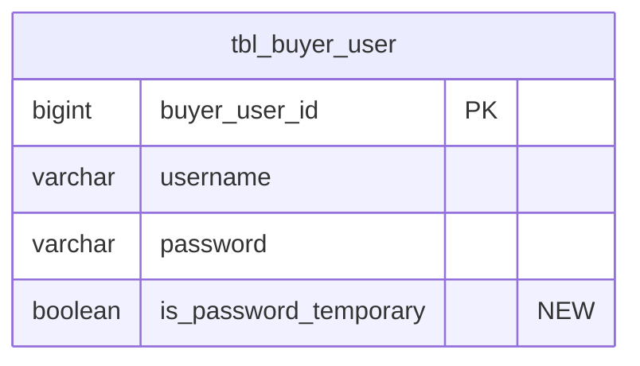
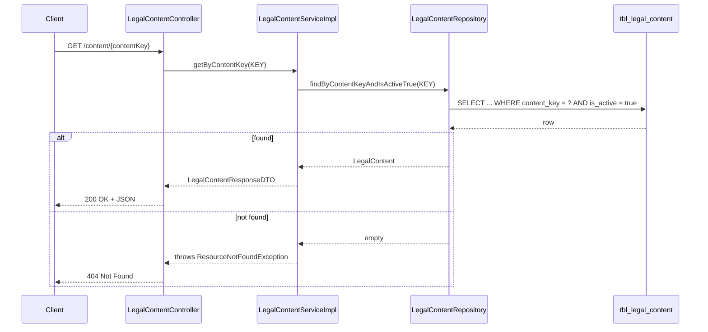
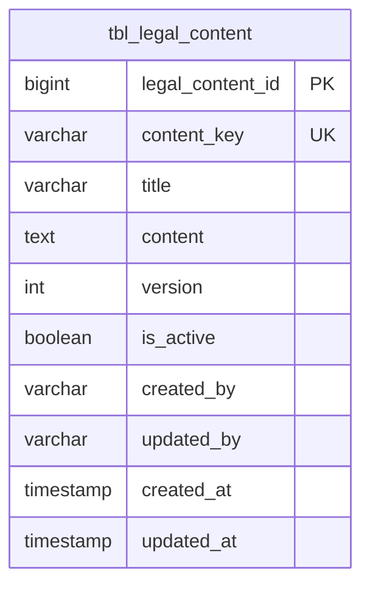
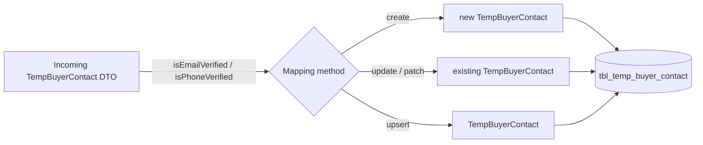
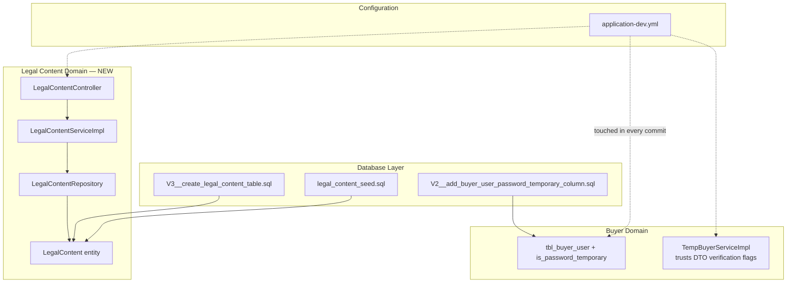

# Change Summary — Last 4 Commits (`feat/stock-update`)

**Branch:** `feat/stock-update`
**Author:** somil-tiameds
**Range:** `a040682` → `3ef91d2`

| # | Commit | Date | Type | Summary |
|---|--------|------|------|---------|
| 1 | `a040682` | 2026-08-24 | refactor | Add `is_password_temporary` column to `tbl_buyer_user` |
| 2 | `10e99b5` | 2026-08-24 | feature | Implement Legal Content management API |
| 3 | `9825d4d` | 2026-08-28 | refactor | `TempBuyerContact` now trusts DTO verification flags |
| 4 | `3ef91d2` | 2026-08-28 | refactor | Update `application-dev.yml` |

---

## 1. `a040682` — Add `is_password_temporary` column to buyer user

**Migration:** `src/main/resources/db/migration/V2__add_buyer_user_password_temporary_column.sql`

Adds a boolean flag to `tbl_buyer_user` marking whether a buyer's current password is
a system-issued temporary one (e.g. set during admin-created accounts or password
resets), so the application can force a password change on next login.



---

## 2. `10e99b5` — Legal Content Management API

Introduces a full vertical slice (entity → repository → service → controller) for
serving versioned legal/static content (Terms of Service, Privacy Policy, etc.) by
a lookup key, plus the Flyway migration and seed data that populate the initial
content set.

**New files**

| Layer | File |
|---|---|
| Entity | `entity/content/LegalContent.java` |
| Repository | `repository/content/LegalContentRepository.java` |
| Service | `service/content/LegalContentService.java` |
| Service Impl | `service/serviceImpl/content/LegalContentServiceImpl.java` |
| DTO | `dto/content/ResponseDTO/LegalContentResponseDTO.java` |
| Controller | `controller/content/LegalContentController.java` |
| Migration | `db/migration/V3__create_legal_content_table.sql` |
| Seed data | `db/seed/legal_content_seed.sql` |
| API docs | `docs/Legal-Content.postman_collection.json` |

**Request flow**



**Data model**



**Endpoint**

```
GET /api/v1/content/{contentKey}   (contentKey is upper-cased before lookup)
```

- Only rows with `is_active = true` are ever returned; content is versioned so
  older, deactivated versions remain in the table for audit purposes.
- 404 is raised via `ResourceNotFoundException`, handled globally by
  `GlobalExceptionHandler`.

---

## 3. `9825d4d` — `TempBuyerContact` trusts DTO-provided verification flags

**File:** `service/serviceImpl/temp/buyer/TempBuyerServiceImpl.java`

Previously, `emailVerified` / `phoneVerified` on a `TempBuyerContact` were always
hardcoded to `false` on create/update — meaning verification state coming from
the client (e.g. after an OTP flow completed elsewhere) was silently discarded.
This change makes the mapping methods copy `dto.isEmailVerified()` /
`dto.isPhoneVerified()` onto the entity instead of forcing `false`, across all
three code paths: create, patch/update, and upsert.



**Before:** `contact.setEmailVerified(false)` / `setPhoneVerified(false)` — always reset.
**After:** `contact.setEmailVerified(dto.isEmailVerified())` / `setPhoneVerified(dto.isPhoneVerified())` — trusts upstream state.

> ⚠️ Note: this shifts responsibility for verification correctness to whatever
> populates the DTO — any endpoint that accepts this DTO from an untrusted
> client must not allow the caller to set these flags directly to `true`
> without an actual OTP verification step having occurred.

---

## 4. `3ef91d2` — `application-dev.yml` update

Minor 2-line configuration change to the `dev` profile (no application code
touched). Consistent with the same 2-line diff also seen bundled into commits
`a040682`, `10e99b5`, and `9825d4d` — the dev YAML has been touched incrementally
alongside each of those feature/refactor commits.

---

## Overall Change Footprint



---

## Risk / Review Notes

- **Security:** `LegalContentController` is unauthenticated by design (public
  content, e.g. Terms & Privacy) — consistent with `SecurityConfig`'s current
  `permitAll()` posture.
- **Data integrity:** verification-flag change (`9825d4d`) means any caller of
  `TempBuyerService` create/update paths can now set `emailVerified`/`phoneVerified`
  directly — confirm all callers only set `true` after real OTP verification.
- **Migrations:** `V2` and `V3` are the first Flyway migration files added to the
  repo; `ddl-auto` is still `update` in `dev`, so verify no conflict/duplication
  between Hibernate auto-DDL and the new Flyway scripts before promoting to an
  environment with `ddl-auto: validate` (prod).
