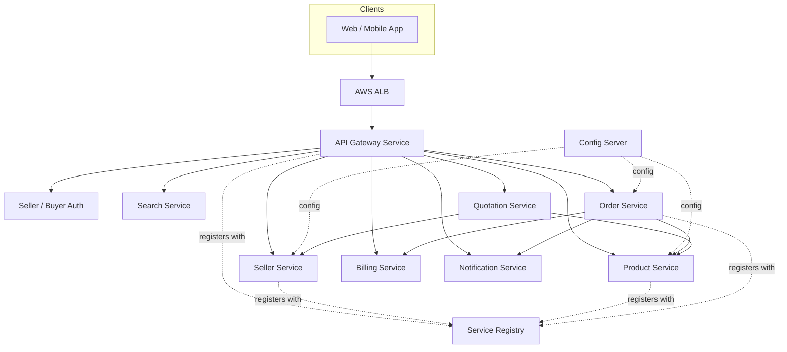
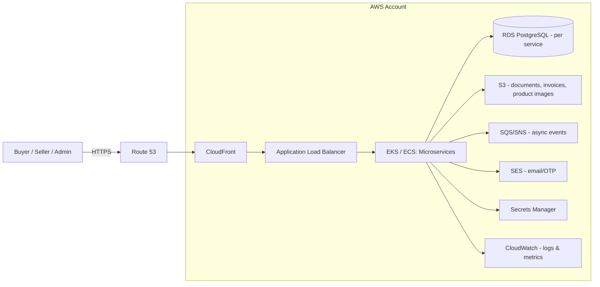
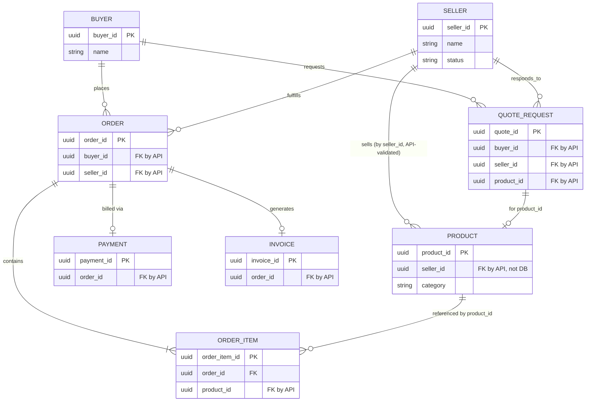
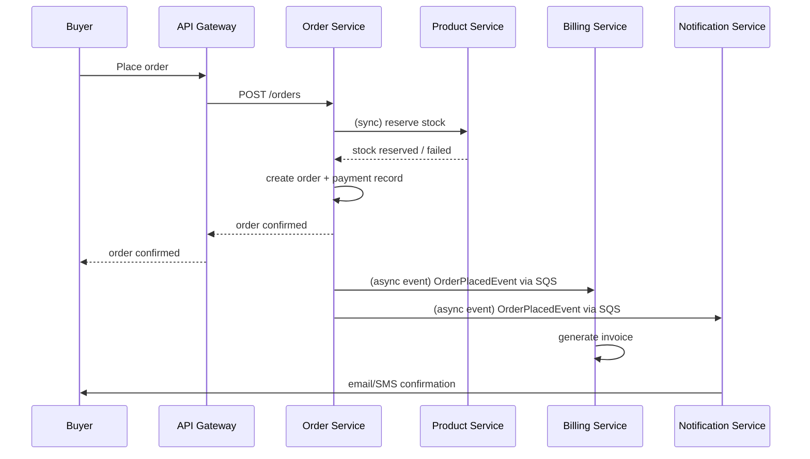

# Pharma Marketplace: Monolith → Microservices (Simple HLD)

## 1. Scope

Today the pharma marketplace backend runs as **one Spring Boot application** (this repo) with one database, covering seller onboarding, product catalog, orders, and admin approval. As the product grows, we're splitting it into **independently deployable microservices**, each owning its own data, so teams can build, deploy, and scale each part on its own.

This document covers only: why we're moving, the target architecture, who talks to whom, and the main building blocks. It intentionally skips deep implementation detail.

## 2. Why microservices

| Problem today (monolith) | What splitting fixes |
|---|---|
| One codebase, one deploy — a bug in Order can block a Product release | Each service ships independently |
| One database — Product's huge catalog and Order's transactional load compete for the same DB | Each service gets its own database, sized for its own workload |
| Can't scale parts separately — e.g. Search/Product read traffic vs Order write traffic | Scale each service independently (more instances where needed) |
| Hard to onboard new devs into one huge codebase | Smaller, focused services are easier to understand and own |

## 3. High-Level Architecture

Target: ~9 services behind a single API Gateway, each with its own database, running on AWS.

## 4. System Context (AWS only)

> A colored, AWS-icon-style version of this diagram (same style as typical AWS reference architectures) is in [`aws-architecture-diagram.html`](./aws-architecture-diagram.html) — open it in a browser.

Everything runs on AWS. No third-party diagram beyond AWS-managed services.

- **Route 53 + CloudFront**: DNS and edge caching for the frontend.
- **ALB**: routes traffic into the cluster running all microservices.
- **EKS/ECS**: hosts every microservice container (API Gateway, Auth, Seller, Product, Order, Quotation, Billing, Notification, Search, Config Server, Service Registry).
- **RDS PostgreSQL**: one database per service (not shared) — this is the core change from the monolith's single DB.
- **S3**: seller documents, invoices/PDFs, product images.
- **SQS/SNS**: async communication between services (e.g. Order → Notification, Order → Billing) instead of direct in-process calls.
- **SES**: transactional email (OTP, approvals).
- **Secrets Manager**: DB credentials, JWT secrets, third-party API keys.
- **CloudWatch**: centralized logs and metrics across all services.

## 5. Components (services)

| Service | Owns | Replaces (from monolith) |
|---|---|---|
| API Gateway | Routing, single entry point for clients | — (new) |
| Service Registry | Service discovery | — (new) |
| Config Server | Centralized config per environment | `application-*.yml` |
| Seller Service | Seller onboarding, approval, profile | `seller`, `temp/seller`, admin approval |
| Buyer / Auth | Buyer + seller login, JWT, OTP | `auth`, `SellerLogIn`, buyer auth |
| Product Service | Product catalog, categories, bulk import | `product`, `master` (product-related) |
| Search Service | Product search/browse for buyers | new, built on top of Product data |
| Quotation Service | Buyer-seller quote requests | `QuoteRequest` |
| Order Service | Orders, order status, returns | `order` |
| Billing Service | Payments, invoices, refunds | `payment`, `invoice`, `refund` |
| Notification Service | Email/SMS notifications | `EmailService`, `TwilioOTPService` |

## 6. ER Diagram (simplified, per service)

Each service owns its own tables — no shared database, no cross-service foreign keys. Cross-service links (e.g. `seller_id` on a product) are just plain IDs, validated via API call, not a DB join.

## 7. How services communicate

Two modes: **synchronous (REST, via API Gateway or service-to-service call)** for anything that needs an immediate answer, and **asynchronous (SQS/SNS events)** for anything that can happen a moment later.

**Rule of thumb:**
- **Sync (REST)**: only when the caller needs the result right now to proceed (e.g. Order needs to know stock is reserved before confirming).
- **Async (SQS/SNS event)**: everything else — notifications, invoicing, stock restore on cancel, seller-approval emails — so one slow/down service doesn't block another's request.

| From → To | Type | Example |
|---|---|---|
| Order → Product | Sync | Reserve/release stock |
| Order → Seller | Sync | Validate seller_id |
| Quotation → Product / Seller | Sync | Validate product/seller on quote |
| Order → Billing | Async | `OrderPlacedEvent` → generate invoice |
| Order → Notification | Async | `OrderPlacedEvent` / `OrderCancelledEvent` → email/SMS |
| Seller → Notification | Async | `SellerApprovedEvent` → email |
| Product → Search | Async | `ProductUpdatedEvent` → refresh search index |
| Any service → Config Server | Sync (startup) | Fetch config on boot |
| Any service → Service Registry | Sync (startup) | Register/discover |

## 8. Migration approach (short version)

We migrate incrementally, service by service (strangler-fig pattern), not a big-bang rewrite:
1. Extract low-risk shared/reference data first.
2. Extract Auth (everyone else depends on it).
3. Extract Seller and Buyer/Onboarding.
4. Extract Product Catalog.
5. Extract Order/Billing last (most dependent on everything else).
6. Retire the monolith once all services are live and the frontend is cut over.
